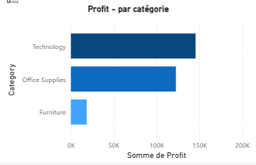
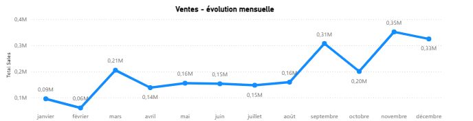

# Data Analyst Portfolio – Chahinaz

Bonjour, je suis Chahinaz, Data Analyst spécialisée dans l’analyse de données et la visualisation.

## 🔧 Compétences
- Data Analysis
- Power BI (Dashboards, KPI, DAX)
- SQL (requêtes, jointures, agrégations)
- Python (pandas, nettoyage et analyse de données)
- Data Visualization & Reporting

## 📊 Sales Performance Dashboard – Power BI

Projet d’analyse de la performance commerciale basé sur des données de ventes.

### Objectifs
- Suivre le chiffre d’affaires
- Identifier les produits et catégories les plus performants
- Analyser l’évolution des ventes

### KPI & Visualisations

