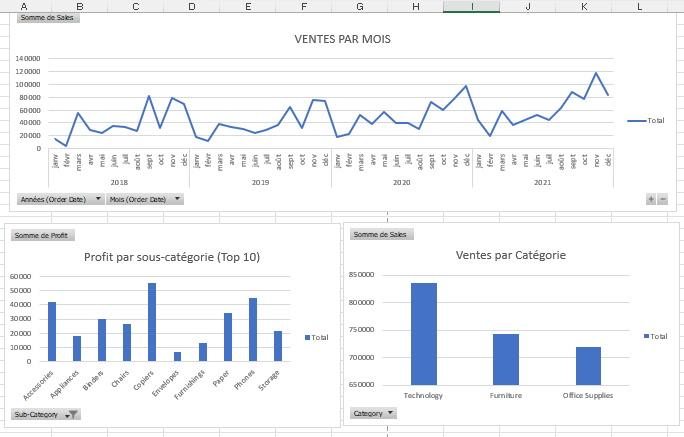

# 📊 Tableau de bord Excel – Analyse des ventes (Superstore)

Tableau de bord Excel interactif réalisé à l’aide de **tableaux croisés dynamiques** et de **graphiques**, basé sur le jeu de données **Superstore**.

Ce projet met en avant ma capacité à analyser des données commerciales et à construire des visualisations claires et exploitables directement dans Excel.

---

## 🎯 Objectifs du projet

- Analyser l’évolution des ventes dans le temps  
- Identifier les catégories de produits les plus performantes  
- Mettre en évidence les sous-catégories les plus rentables  
- Créer un tableau de bord lisible pour un usage business

---

## 📈 Contenu du tableau de bord

- 📅 **Évolution mensuelle des ventes**
- 🗂️ **Ventes par catégorie de produits**
- 🏆 **Top 10 des sous-catégories par profit**
- 📊 Indicateurs clés basés sur les ventes

---

## 🛠️ Outils utilisés

- Microsoft Excel  
- Tableaux croisés dynamiques  
- Graphiques dynamiques  

---

## 🖼️ Aperçu du tableau de bord

### Vue générale

---

## 📁 Données

- Dataset : **Superstore**
- Données nettoyées et analysées directement dans Excel

---

## 📌 Remarque

Le fichier Excel complet peut être transmis **sur demande**.

