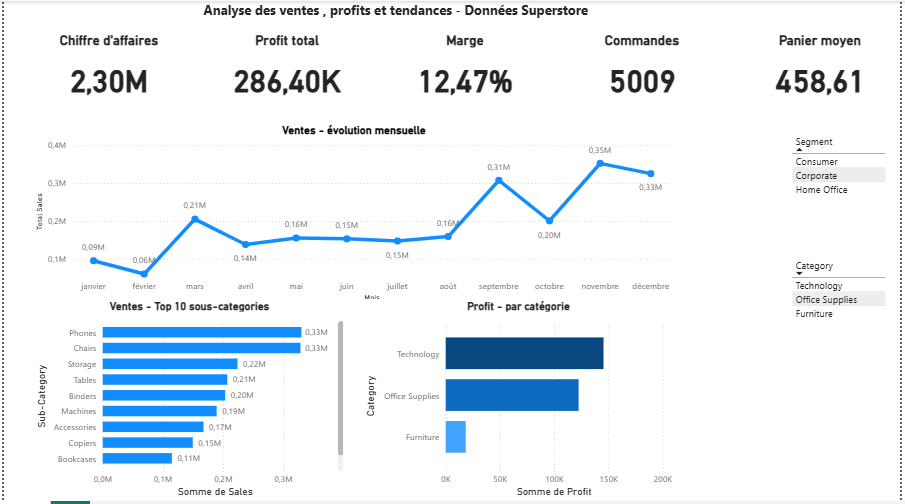

#  Tableau de bord Power BI – Analyse des ventes (Superstore)

Tableau de bord interactif réalisé avec **Power BI**, basé sur le dataset **Superstore**, permettant d’analyser les performances commerciales et les indicateurs clés de l’activité.

Ce projet démontre ma capacité à transformer des données brutes en insights business à l’aide de visualisations professionnelles.

---

##  Objectifs du projet

- Suivre les performances globales des ventes
- Analyser le profit par catégorie et région
- Identifier les tendances commerciales
- Mettre en place des KPI clairs pour la prise de décision

---

##  Indicateurs clés (KPI)

- Chiffre d’affaires total
- Profit total
- Nombre de commandes
- Performance par catégorie et région

---

##  Visualisations principales

-  Ventes et profits globaux
-  Analyse par catégorie de produits
-  Analyse géographique
-  Évolution temporelle des ventes

---

##  Outils utilisés

- Power BI Desktop  
- DAX (mesures et KPI)
- Dataset Superstore

---

##  Aperçu du tableau de bord

### Vue d’ensemble

---

##  Données

- Dataset : **Superstore**
- Données nettoyées et modélisées dans Power BI

