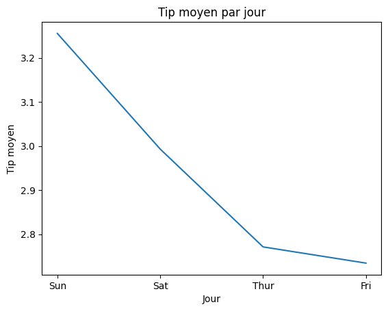
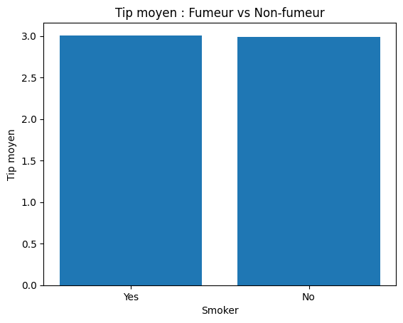

# Projet Python – Analyse de données (Tips)

Analyse exploratoire de données réalisée avec Python sur le dataset **Tips**.

## Objectifs
- Contrôle qualité des données
- Calcul des KPI business
- Analyse des comportements de pourboire
- Visualisations claires et exploitables

## Analyses réalisées
- KPI : total tips, tip moyen, addition moyenne, volume
- Agrégation par jour (tip moyen, nombre de transactions)
- Comparaison fumeur vs non-fumeur

## Visualisations

### Tip moyen par jour

### Comparaison fumeur vs non-fumeur

## Outils
Python, Pandas, Matplotlib, Seaborn  
Notebook exécuté sur Google Colab
