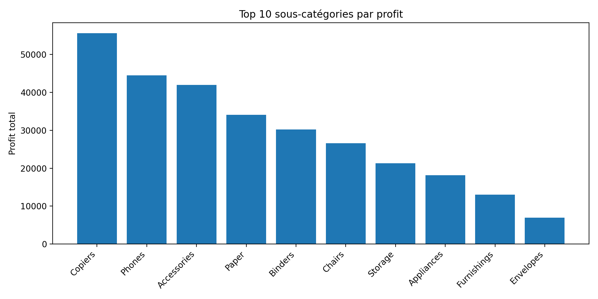
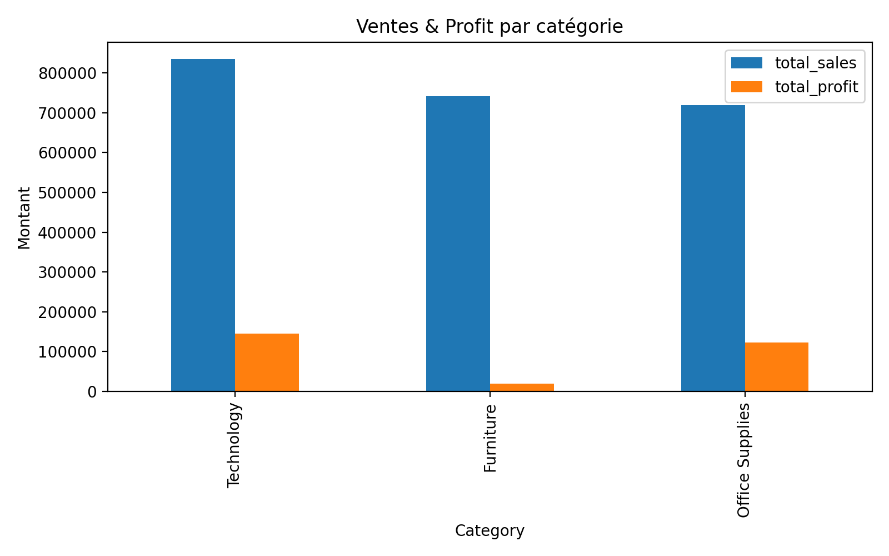
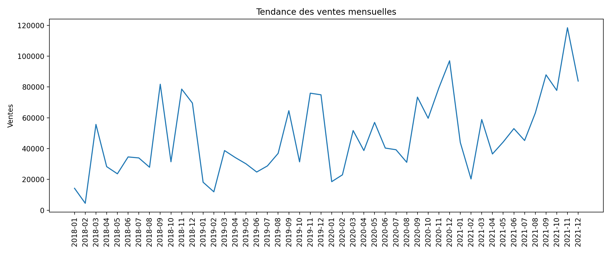

# Projet SQL – Analyse des ventes (Superstore)

Analyse SQL réalisée à partir du dataset **Superstore** afin d’extraire des KPIs business
et identifier les catégories/sous-catégories les plus rentables.

## Objectifs
- Mesurer les ventes et le profit par catégorie
- Identifier les sous-catégories les plus rentables (Top 10)
- Observer la tendance des ventes mensuelles
- Identifier les meilleurs clients (Top 10)

## Requêtes principales
Les requêtes sont disponibles ici : `queries.sql`

## Résultats (extraits)
### Top 10 sous-catégories par profit

### Ventes & Profit par catégorie

### Tendance des ventes mensuelles

## Outils
- SQL (SQLite)
- Google Colab (pour exécuter les requêtes et générer les graphiques)
- Pandas / Matplotlib (visualisation)
